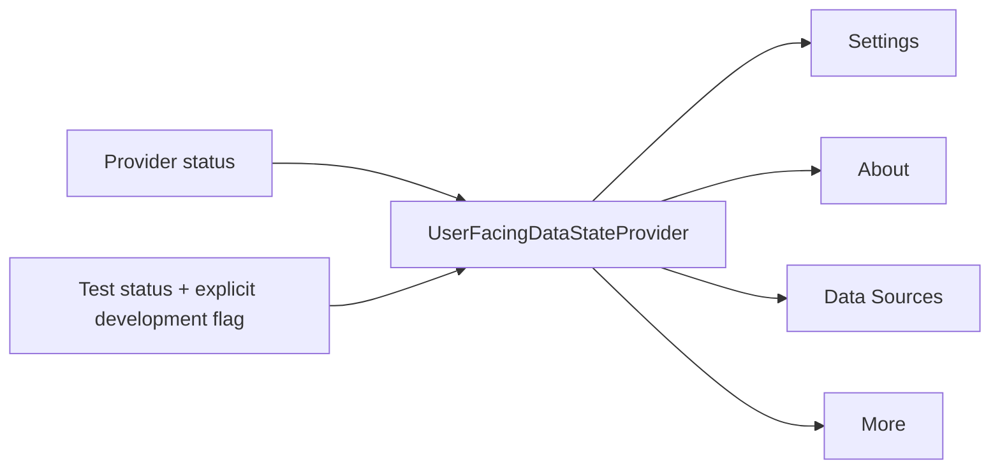
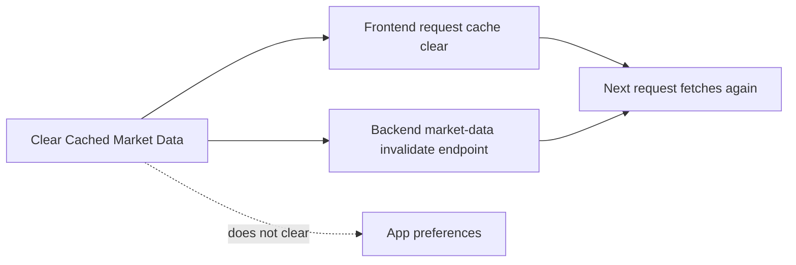

# Stage 11.3 — Settings Consumer Registry

## Authoritative registry

Runtime audit metadata lives in `frontend/src/architecture/settingsBetaRegistry.ts`. Persisted preference ownership remains in `frontend/src/architecture/settingsConsumerRegistry.ts` and `frontend/src/features/preferences/appPreferencesModel.ts`.

| ID | Owner | Input | Persistence | Authoritative consumer | Output / effect | Beta interaction |
|---|---|---|---|---|---|---|
| `appearance.dark` | Appearance | Beta visual-system support | None | Application dark visual system | Supported theme disclosure | Static selected state |
| `appearance.system` | Appearance | Legacy theme value | None in beta; legacy value normalized | None until complete light support | No beta behavior | Disabled |
| `accessibility.reduceMotion` | App preferences | User switch + platform reduce-motion signal | Web local storage / native app document | `useReducedMotion` | Resolved animation policy for AppScreen, DetailModal, splash, command and Home | Enabled |
| `accessibility.colorMeaning` | Shared state presentation | Existing badge/status contracts | None | Shared status badges and text labels | State meaning never depends on color alone | Static disclosure |
| `language.english` | Application copy | Bundled English strings | None | All screen copy | English UI | Static active state |
| `language.traditionalChinese` | Future localization | None | None | None until translations ship | No beta behavior | Disabled |
| `notifications.push` | Future notification delivery | None | None | None until delivery exists | No beta behavior | Disabled |
| `profile.displayName` | Local profile | Text input | Web local storage / native app document | More profile destination summary | Device-local display label | Enabled |
| `dataUsage.clearMarketDataCache` | Data Usage | User action | Action only | `clearRequestCache` + `/market-data/cache/invalidate` | Removes frontend/backend market-data caches | Enabled |
| `dataSources.status` | `UserFacingDataStateProvider` | Provider status, test status, runtime flag | Recomputed | Settings, About, Data Sources, More | Canonical headline, explanation and availability meaning | Navigation/status |
| `privacy.disclosure` | Privacy | Actual local/remote data behavior | None | Privacy route | Trust disclosure | Navigation |
| `about.systemInformation` | About | App info + shared data state + provider status | Recomputed | About route | Version/build/environment/system status | Navigation |
| `scenario.testControls` | Development test-data service | Explicit test-scenario flag + scenario selection | Server development fixture state | Test-data scenario endpoints | Regenerates deterministic fixtures | Absent in beta |
| `future.userAccounts` | Future accounts | None | None | None | No beta behavior | Disabled |
| `future.subscription` | Future subscription | None | None | None | No beta behavior | Disabled |

## Persistence contract

The only user-editable local preferences in beta are:

- `appearance.reduceMotion`
- `profile.displayName`

They share the versioned `market-intelligence-app-preferences-v1` record. Web uses local storage; native uses the app document directory. Migration is tolerant of missing/invalid records, preserves both supported values, and normalizes legacy `appearance.theme = system` to the supported beta value `dark`.

No notification, language, data-usage, account, subscription, or scenario selection is written into the app-preferences record.

## Canonical data-state flow

The four surfaces consume the same `headline`, `explanation`, and availability model. Scenario state can influence the shared owner only when the explicit scenario flag is active and the configured provider is a test provider.

## Cache action flow

