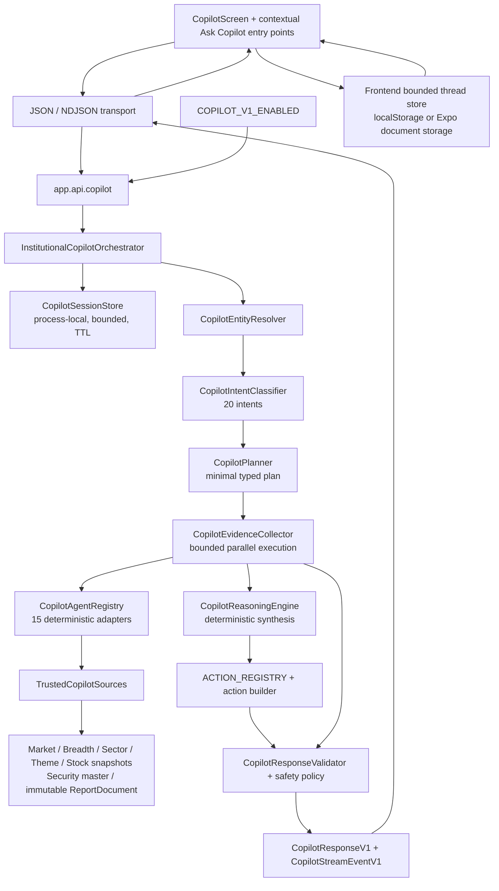

# Stage 7 Institutional Copilot repository inventory

Audit date: 2026-07-22

Repository root: `/Users/andypun/Downloads/market-intelligence-app`

Machine-readable source: `backend/app/copilot/agent_manifest.json`

## Executive finding

The active Stage 7 path contains **15 registered specialist adapters**: Market, Index, Breadth, Leadership, Sector, Theme, Macro, Risk, Stock, Watchlist, Report, Research, Navigation, Educational, and Portfolio. They are registered in `CopilotAgentRegistry._handlers` and exactly match `CopilotAgentName`.

These are not autonomous personas and do not call a language model. Every active specialist is a deterministic, read-only function over `AgentExecutionContext`; every one returns the versioned Pydantic `AgentResultV1` contract. The active synthesis layer is also deterministic. No prompt template, prompt version, model client, or model version is used anywhere under `backend/app/copilot/`.

There is a separate pre-Stage-7 implementation in `backend/app/services/copilot_service.py` that imports `COPILOT_SYSTEM_PROMPT` and `generate_structured_chat_response`. Repository search found callers only in `backend/tests/test_copilot.py` and `backend/scripts/validate_phase_4_4d_pilot_integration.py`. The application route in `backend/main.py` mounts `backend/app/api/copilot.py`, which calls `InstitutionalCopilotOrchestrator`, not that legacy service. The legacy prompt/model path is therefore **present but not on the active `/copilot/chat` or `/copilot/chat/stream` request path**.

## Architecture



The planner records a dependency map, but current plans give every emitted step an empty `depends_on` list and `parallel_group=1`. Optional agents are declared on the intent for future expansion/fallback context; `CopilotPlanner.build` currently executes only the de-duplicated `required_agents` list.

## Runtime component inventory

| Concern | Repository implementation | Observed behavior |
|---|---|---|
| HTTP endpoints | `backend/app/api/copilot.py` | `POST /copilot/chat` returns `CopilotResponseV1`; `POST /copilot/chat/stream` emits NDJSON `CopilotStreamEventV1` records. |
| Request schema | `backend/app/schemas/copilot.py` | `CopilotChatRequest`; merges `context` and `screenContext`, carries compact `sessionContext`, request/thread IDs, history and response depth. History/response depth are accepted for compatibility but are not consumed by the active orchestrator. |
| Entity resolution | `backend/app/copilot/entities.py` | Resolves registered securities, indexes, sectors, themes, report sections, screen hints, and active session entities; unknown uppercase ticker-like tokens remain unresolved. |
| Intent classifier | `backend/app/copilot/intent.py` | Deterministic rules produce one of 20 `CopilotIntentType` values and required/optional agents. Prompt-injection text routes to unsupported/ambiguous. |
| Planner | `backend/app/copilot/planner.py` | Builds `CopilotPlanV1`, evidence/freshness requirements, latency limits, response template, fallbacks, and registered destination requirements. |
| Specialist registry | `backend/app/copilot/agents.py` | Exactly 15 enum-backed handlers. `execute` catches exceptions and emits typed failed output. |
| Trusted-source facade | `backend/app/copilot/sources.py` | Read-only access to durable snapshots and latest validated `ReportDocument`; watchlist is identity-only and unavailable unless device-local membership is supplied. |
| Evidence registry | `CopilotEvidenceV1`, `CopilotSourceReferenceV1`, and `ReportDocument.sources/evidence/claims` | Stable evidence/source IDs, freshness, confidence, interpretation class, report references, claim support and contradiction IDs. There is no separate mutable Copilot evidence database. |
| Collector | `backend/app/copilot/collector.py` | Executes independent required steps with at most four workers by default, enforces bounded plan timeout, preserves completed results, de-duplicates evidence/source IDs, and aggregates freshness conservatively. |
| Synthesis | `backend/app/copilot/reasoning.py` | Deterministic challenge-mode reasoning with cited support, opposition, risk, confirmation, invalidation, missing evidence, stance, and confidence label. |
| Validation | `backend/app/copilot/validation.py`, `backend/app/copilot/policy.py` | Validates evidence references, numbers, tickers, sources, causality, ownership, stale actionability, recommendations, prompt injection, and registered actions; failed synthesis is replaced by a deterministic safe fallback and revalidated. |
| Deep links | `backend/app/copilot/actions.py`; frontend `copilotDestinations.ts` | Backend emits typed registered destinations/routes; frontend resolves and validates the destination before navigation. |
| Memory | `backend/app/copilot/sessions.py` | Process-local `OrderedDict`, maximum 500 sessions, six-hour default TTL, lock-protected, compact typed fields only, and optimistic revision protection against late cancelled requests. No server persistence across process restart. |
| Frontend persistence | `frontend/src/features/copilot/state/copilotStore.ts` | Best-effort bounded local transcript/session store: at most six threads and twelve messages each; web `localStorage` with Expo document-file fallback. |
| Streaming/cancel/retry | Backend orchestrator/API; frontend `copilotStream.ts`, `copilotReducer.ts`, `CopilotScreen.tsx` | Typed section events, partial state preservation, client abort, retry, malformed-stream and timeout categories. The backend emits start/intent/plan, runs `_complete` synchronously, and only then emits answer/evidence/conditions/actions; this is section transport, not token or incremental agent-result streaming. Computation may finish after a client abort; session revision checks prevent stale completion from overwriting newer context. |
| Logs/traces | `backend/app/copilot/orchestrator.py`, `backend/app/copilot/tracing.py` | Production structured logs omit prompts and private values. Opt-in development traces are inspectable by request ID and include routing, actual triggered rules, evidence/snapshot IDs, freshness caps, fallback history, links and latency. Secrets, PII and device-local membership are redacted or pseudonymized; early pipeline failures also produce a trace. Cache hit rate remains null because upstream adapters do not expose cache telemetry. |
| Feature flag | `COPILOT_V1_ENABLED` in `backend/.env.example` and `orchestrator.py` | Single server-side switch covers both JSON and NDJSON routes. |
| Active model/prompt | None | `generatedBy` is `institutional-copilot-v1-deterministic`; all agent `promptVersion` and `modelVersion` values are null in the manifest. |
| Legacy model/prompt | `backend/app/services/copilot_service.py`, `copilot_prompt_builder.py`, `openai_client.py` | Pre-Stage-7 rules-plus-optional-OpenAI path remains for old tests/scripts but is not mounted by the active Copilot API. |
| Frontend surface | `frontend/src/features/copilot/`, `frontend/src/app/ai.tsx`, contextual buttons on home/market/sectors/watchlist/report/stock cards | Structured answer, evidence, contradiction, confidence/freshness, conditions, actions, streaming draft, cancellation and retry. |
| Fixtures/artifacts | `backend/tests/fixtures/stage7_copilot.py`, `backend/scripts/generate_stage7_copilot_artifacts.py`, `output/stage-7/` | Thirty executable public-pipeline cases plus manual, visual, performance and trace artifacts. The fixture generator uses an injected deterministic fixture registry, not every production snapshot adapter. |

## Common specialist contract

All specialists are implemented in `backend/app/copilot/agents.py` and accept:

```text
AgentExecutionContext
  request_id: str
  question: str
  intent: CopilotIntentV1
  plan: CopilotPlanV1
  client_context: dict[str, Any]
```

Every handler returns `AgentResultV1` with schema version `copilot-agent-result-v1`:

```text
agent + status
observations + conclusions + contradictions
metrics + levels
source_references + evidence
freshness
deep_link_targets
warnings + missing_data
duration_ms + failure_category
```

`AgentResultV1` does not itself contain final answer confidence, final confirmation/invalidation lists, a generated timestamp, or a response version. Those are intentionally added downstream: evidence has per-item confidence/freshness, reasoning produces confirmation/invalidation and confidence label, and `CopilotResponseV1.grounding.generated_at` records response generation time. The manifest therefore does not pretend these are specialist-owned fields.

Every specialist is consumed first by `CopilotEvidenceCollector`, then by deterministic reasoning, action construction, validation, `CopilotResponseV1`, and the structured frontend renderer. Agent-specific intent consumers are listed below.

## Specialist inventory

| Agent / handler | Purpose and accepted inputs | Dependencies and evidence source | Output categories / destinations | Intent consumers | Fallback |
|---|---|---|---|---|---|
| Market / `_market` | Market health posture. Uses plan freshness age; no entity filter. | `TrustedCopilotSources.market_snapshot`; durable `MarketSnapshot.health`: status, score, summary, improving/weakening factors. | `market`; `market_overview`, `health`. | `MARKET_STATE`, `MARKET_EXPLANATION`, `STOCK_DECISION_SUPPORT`. | Typed unavailable without a snapshot; weakening factors remain contradictions; source warnings propagate. |
| Index / `_index` | Registered index price/change/trend. Uses `intent.ticker_symbols` and plan freshness age. | Same durable `MarketSnapshot`, `indexes` section. | `index`; `indexes`. | `INDEX_ANALYSIS`. | Typed unavailable without snapshot; unmatched requested indexes do not create evidence. |
| Breadth / `_breadth` | Participation, MA breadth, A/D ratio, trend/classification and divergences. Uses plan freshness age. | Durable `BreadthSnapshot` from breadth snapshot service. | `breadth`; `breadth`. | `BREADTH_QUERY`, `MARKET_EXPLANATION`, `STOCK_DECISION_SUPPORT`. | Typed unavailable without snapshot; recorded divergences are preserved; coverage/warnings constrain output. |
| Leadership / `_leadership` | Top-five reviewed sector leadership; no entity filter. | Durable `SectorSnapshot.rankings` and sector rows. | `leadership`; `leadership`. | Taxonomy-level `SECTOR_ANALYSIS`; optional context for market/theme/stock intents. | Typed unavailable without snapshot; never computes a replacement rank. |
| Sector / `_sector` | Requested-sector or reviewed top-sector rank/classification/score. Uses `intent.sectors`. | Durable `SectorSnapshot`; shared ranked-snapshot adapter. | `sector`; `sector_detail`. | `SECTOR_ANALYSIS`. | Typed unavailable without snapshot; absent requested row stays absent; unfiltered output is capped at five. |
| Theme / `_theme` | Requested-theme or reviewed top-theme rank/classification/score. Uses `intent.themes`. | Durable `ThemeSnapshot`; shared ranked-snapshot adapter. | `theme`; `theme_detail`. | `THEME_ANALYSIS`. | Typed unavailable without snapshot; absent requested row stays absent; unfiltered output is capped at five. |
| Macro / `_macro` | Registered report macro/cross-asset evidence. Uses question terms and plan freshness age. | Latest validated `ReportDocument`; evidence metrics matching rate/yield/Treasury/oil/dollar/gold/credit/macro/inflation; registered sources/claims. | `macro`; `macro`. | `MACRO_QUERY`; optional `MARKET_EXPLANATION`. | Typed unavailable without report; explicit missing data when no metric matches; no event/causal invention. |
| Risk / `_risk` | Registered risk evidence, monitoring rationales and report-thesis invalidation conditions. Uses question terms and plan freshness age. | Latest validated `ReportDocument`, risk evidence, thesis and monitoring conditions. | `risk`; `health`, `report_scenarios`. | `RISK_QUERY`, `STOCK_DECISION_SUPPORT`, related follow-ups. | Typed unavailable without report; invalidations remain contradictions; no hard-coded risk events. |
| Stock / `_stock` and `_one_stock` | Setup, risk, technical, trend, volume, relative strength and levels for at most ten symbols. Uses `intent.ticker_symbols`; for watchlist review may use identity-only saved symbols. | Durable `StockAnalysisSnapshot` via `get_latest_snapshot`; explicitly no request-time provider refresh. | `technical`, `signal`, `leadership`; `stock_detail`, `stock_technical`, `stock_risk`. | `STOCK_ANALYSIS`, `STOCK_DECISION_SUPPORT`, `STOCK_COMPARISON`, `WATCHLIST_REVIEW`, stock follow-ups. | Typed unavailable without symbols; per-symbol gaps merge conservatively; test/mock snapshots are labelled test. |
| Watchlist / `_watchlist` | Saved-symbol membership only. Uses accepted membership keys from `client_context` and request ID; never accepts scores or prices. | Device-local identity hint or `TrustedCopilotSources.watchlist_membership` unavailable boundary. | `watchlist`; `watchlist`. | `WATCHLIST_REVIEW`. | Missing membership is unavailable, not empty; explicit empty is complete; device-local scope disclosed; never infers holdings. |
| Report / `_report` | Latest thesis/claims/evidence, report-change branch, and scenario or thesis conditions. Uses question, `intent.intent`, `intent.sub_intent`, freshness age. | Immutable latest `ReportDocument`, registered evidence and sources. | `report`; `report`. | `REPORT_QUERY`, `RISK_QUERY`, `SCENARIO_QUERY`, `RESEARCH_QUERY`, generic follow-up fallback. | Typed unavailable without report; missing prior immutable report is explicit; condition provenance is retained. |
| Research / `_research` | Qualified Research Focus selection, evidence, counter-thesis and conditions. Uses question and freshness age. | `ReportDocument.research_focus` plus its evidence IDs and registered sources. | `research`; `report_research_focus`. | `RESEARCH_QUERY`; optional `THEME_ANALYSIS` and `STOCK_DECISION_SUPPORT`. | Typed unavailable without report/focus; counter-thesis and invalidations stay contradictions; no prior-focus continuity inferred. |
| Navigation / `_navigation` | Local destination mapping. Uses `intent.sub_intent` only. | `navigation_destination`; downstream backend and frontend route registries. | No evidence; any registered destination. | `APP_NAVIGATION`. | Unknown sub-intent defaults to `market_overview`; no market evidence; unregistered action fails validation. |
| Educational / `_educational` | Six bounded glossary definitions. Uses question text only. | Inline glossary: breadth, relative strength, rotation, support, resistance, volume. | No evidence or destination. | `EDUCATIONAL_QUERY`. | Unknown term returns supported-concept list; market-data freshness is intentionally unavailable. |
| Portfolio / `_portfolio` | Explicit boundary for unavailable holdings integration. Consumes no portfolio data. | No provider exists. | No evidence; `watchlist`. | `PORTFOLIO_QUERY`. | Always typed unavailable with exact limitation; offers watchlist/themes without converting them to holdings. |

For all 15 rows: `promptVersion=null`, `modelVersion=null`, `deterministic=true`, and `modelDependent=false`. The complete per-agent input fields, dependency names, evidence fields, destination allowlists, availability behavior and tests are in `backend/app/copilot/agent_manifest.json`.

## Routing matrix

The classifier's default required-agent matrix is:

| Intent | Required agents | Declared optional agents |
|---|---|---|
| `MARKET_STATE` | Market | Breadth, Leadership, Risk |
| `MARKET_EXPLANATION` | Market, Breadth | Leadership, Risk, Macro |
| `INDEX_ANALYSIS` | Index | Market |
| `SECTOR_ANALYSIS` | Sector | Breadth, Leadership |
| `THEME_ANALYSIS` | Theme | Leadership, Research |
| `STOCK_ANALYSIS` | Stock | Market, Leadership |
| `STOCK_DECISION_SUPPORT` | Stock, Market, Breadth, Risk | Leadership, Research |
| `STOCK_COMPARISON` | Stock | Market |
| `WATCHLIST_REVIEW` | Watchlist, Stock | Market, Risk |
| `REPORT_QUERY` | Report | None |
| `RISK_QUERY` | Risk, Report | Market |
| `SCENARIO_QUERY` | Report | Risk |
| `MACRO_QUERY` | Macro | Market |
| `BREADTH_QUERY` | Breadth | Market |
| `RESEARCH_QUERY` | Research, Report | None |
| `PORTFOLIO_QUERY` | Portfolio | None |
| `APP_NAVIGATION` | Navigation | None |
| `EDUCATIONAL_QUERY` | Educational | None |
| `FOLLOW_UP` | Inherits the prior base intent; stock decision follow-ups narrow to Stock + Risk | Context-dependent |
| `UNSUPPORTED_OR_AMBIGUOUS` | None | None |

Two deterministic overrides matter: taxonomy-level sector questions route to Leadership without inventing a sector entity, and a confirmed empty saved-symbol list routes to Watchlist only rather than asking Stock for absent snapshots.

## Existing tests and missing focused coverage

The repository has substantial contract, routing, integration, freshness, safety, streaming, session and exact-action coverage in:

- `backend/tests/test_institutional_copilot.py`
- `backend/tests/test_stage7_copilot_runtime.py`
- `backend/tests/fixtures/stage7_copilot.py`
- `frontend/tests/copilotContracts.test.ts`
- `frontend/tests/copilotTransport.test.ts`
- `frontend/tests/copilotReducer.test.ts`
- `frontend/tests/copilotDestinations.test.ts`

The 30 executable Stage 7 fixtures exercise the public pipeline with an injected deterministic fixture registry. They prove orchestration and contract behavior, but they should not be mistaken for focused tests of every production adapter's field mapping.

| Agent | Existing strongest coverage | Material missing focused coverage |
|---|---|---|
| Market | Client market-value trust boundary; market fixtures/freshness integration. | Frozen real `MarketSnapshot` test for every emitted health field and absent snapshot. |
| Index | Classifier/plan and index-comparison fixture. | Direct adapter filtering, missing row and mixed-index structure. |
| Breadth | Conservative freshness tests and decision challenge fixture. | Direct adapter metric map, divergence preservation and absent snapshot. |
| Leadership | Taxonomy-level routing and executable fixture. | Direct ordering/top-five cap and incomplete row behavior. |
| Sector | Routing and exact destination integration. | Direct requested-sector filter and absent requested sector. |
| Theme | Routing and exact destination integration. | Direct requested-theme filter, absent theme and incomplete provenance. |
| Macro | Routing and executable fixture. | Direct report metric matching, proxy disclosure and unmatched query. |
| Risk | Cited report challenge conditions, stock follow-ups and timeout preservation. | Direct empty/missing/partial report-risk branches. |
| Stock | Hermetic ARM snapshot follow-ups, watchlist enrichment and evidence integrity. | Multi-symbol real-adapter mix of current/stale/test/partial/missing snapshots. |
| Watchlist | Device-local hydrated membership, cited attention candidates, explicit empty and unavailable-not-empty tests. | Authenticated cross-device/account isolation cannot be tested until a provider exists. |
| Report | Cited challenge conditions, scenarios/actions and report fixtures. | One frozen direct-adapter table covering latest/change-with-history/no-history. |
| Research | Cited Research Focus challenge and exact action. | Direct missing focus, broken evidence linkage and unsafe retrieved text. |
| Navigation | Runtime action/log test, local latency plan and exact registry destinations. | Direct exhaustive agent invocation for every destination plus unknown target. |
| Educational | Minimal plan and executable education fixture. | Direct table for all six terms and unknown-term fallback. |
| Portfolio | Exact unavailable response and no-holdings-inference tests. | Provider/auth tests are impossible until the intentionally absent integration exists. |

`backend/tests/test_stage7_agent_manifest.py` adds a narrow inventory guard: it validates JSON structure, enum-to-manifest-to-runtime-handler parity, common schema/model metadata, evidence/destination enum values, freshness values, handler existence, and source/test path existence. It does not change runtime behavior or substitute for the missing adapter tests above.

## Fallback, cache and persistence boundaries

- Registry exceptions are converted to typed `failed` results with unavailable freshness; the exception class is stored only as `failure_category`.
- Missing durable sources return typed `unavailable`; user-supplied market numbers never fill the gap.
- A collector timeout cancels pending futures where possible, returns without waiting for already-running read-only work, and preserves completed evidence.
- Stale, test, partial, mixed and unavailable evidence is explicit and caps final confidence/actionability.
- Validation failure triggers deterministic safe reasoning and a second validation pass. If the second pass still fails, evidence, sources, actions and deep links are quarantined and the response is typed unavailable.
- The Stage 7 package has no specialist result cache of its own. It reads the upstream services' durable latest snapshots.
- Backend conversation continuity is process-local only. Frontend conversation persistence is local to the device and best-effort.
- Saved-symbol membership is device-local identity context, not authenticated ownership. Portfolio remains unavailable.

## Audit commands

The inventory was derived with repository searches and source reads, including:

```bash
rg --files backend/app/copilot backend/tests frontend/src/features/copilot docs
rg -n '^class |^    def _|^def ' backend/app/copilot/*.py
rg -n 'institutional_copilot|copilot/chat|COPILOT_V1_ENABLED' backend --glob '!venv/**'
rg -n 'OpenAI|openai|model|prompt|completion|responses.create' backend/app/copilot backend/app/services
rg -n 'answer_copilot_chat\(' --glob '*.py'
jq -e . backend/app/copilot/agent_manifest.json
```

The focused verification commands and exact results should be recorded with the Stage 7 validation report when the full evaluation pass is complete.
