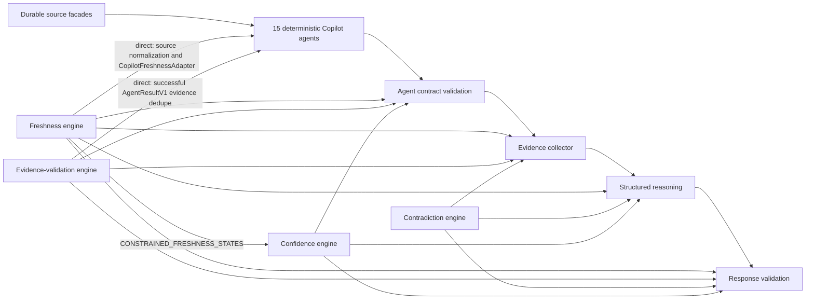
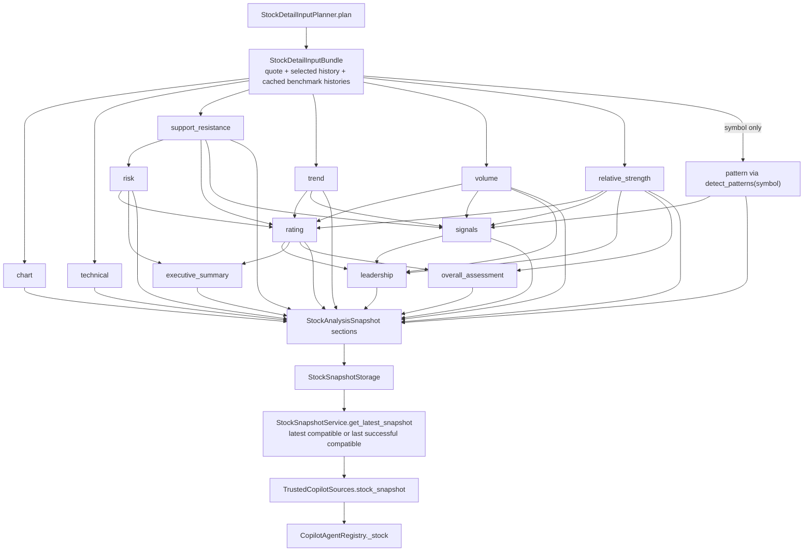

# Stage 7.5 engine dependency map

Inventory date: 2026-07-22

Machine-readable source: `backend/app/analysis_engines/engine_manifest.json`

This map records the dependency shape of the current implementation. It does not treat roadmap names or existing domain service functions as completed shared engines.

## Inventory rule

An engine is **implemented** here only when it has all three of the following:

- executable code under `backend/app/analysis_engines`;
- an explicit version constant;
- public input and output contracts exported by its package.

Under that rule, four shared engines are implemented:

| Shared engine | Version | Implementation | Public input contracts | Public output contracts |
| --- | --- | --- | --- | --- |
| Freshness and availability | `freshness-availability-v1` | `backend/app/analysis_engines/freshness/engine.py` | `FreshnessAvailabilityInput`, `FreshnessSummaryInput` | `FreshnessAvailabilityResult`, `FreshnessSummaryResult` |
| Evidence validation | `evidence-validation-v1` | `backend/app/analysis_engines/evidence_validation/engine.py` | `ClaimBindingInput`, `BreakoutValidationInput`, `BreakoutEvidence`, `SourceRecord` | `StableDeduplicationResult`, `DeduplicationCollision`, `ClaimBindingResult` |
| Contradiction preservation | `contradiction-preservation-v1` | `backend/app/analysis_engines/contradiction/engine.py` | `ContradictionFinding`, `ContradictionAnalysisInput`, `ContradictionPreservationInput` | `ContradictionAnalysisResult`, `ContradictionPreservationResult` |
| Confidence adjustment | `confidence-adjustment-v1` | `backend/app/analysis_engines/confidence/engine.py` | `ConfidenceAdjustmentInput` | `ConfidenceAdjustmentResult`, `ConfidenceRuleContribution` |

The package version is `stage75-analysis-engines-v1`, declared by `ANALYSIS_ENGINE_PACKAGE_VERSION` in `backend/app/analysis_engines/__init__.py`.

## Direct adapter use versus shared downstream validation

“Direct adapter” means an engine runs while source facts are normalized or an `AgentResultV1` is being constructed. “Downstream” means the engine runs after an agent result exists: at the registry contract, collector, reasoning, or final response-validation boundary.

### Runtime consumer matrix

| Engine | Direct adapter consumers | Shared downstream consumers | Engine-to-engine dependency |
| --- | --- | --- | --- |
| Freshness and availability | `CopilotFreshnessAdapter.evaluate`, `CopilotFreshnessAdapter.aggregate_states`; `agents._freshness`, `agents._merge_freshness`; source helpers `normalize_source_state`, `aggregate_source_states`, `is_expired`, `freshness_state`, `parse_datetime` | `agent_contracts.validate_agent_result`; `collector._freshness_summary`; `reasoning._confidence`, `reasoning._is_constrained`; response confidence and stale-actionability checks | None |
| Evidence validation | `CopilotEvidenceValidationAdapter.deduplicate`; `agents._dedupe_agent_evidence` through `agents._result` | agent-contract evidence-ID uniqueness; collector evidence dedupe; response source/timestamp validation, metric-family matching, claim binding, semantic compatibility, and confirmed-breakout validation | None |
| Contradiction preservation | None. Agents emit typed contradiction facts and claim links but do not call this engine. | collector explicit-contradiction classification; reasoning support/opposition partition; response contradiction-preservation validation | None |
| Confidence adjustment | None. Agents retain evidence-level labels but do not set final response confidence with this engine. | agent-contract freshness caps; reasoning confidence assignment and constrained-state detection; response confidence and stale-actionability validation | Imports `CONSTRAINED_FRESHNESS_STATES` from the freshness engine |

The production import surface is limited to these files:

- `backend/app/copilot/engine_adapters.py`
- `backend/app/copilot/sources.py`
- `backend/app/copilot/agents.py` through the adapters
- `backend/app/copilot/agent_contracts.py`
- `backend/app/copilot/collector.py`
- `backend/app/copilot/reasoning.py`
- `backend/app/copilot/validation.py`

Tests and benchmarks are verification consumers, not production dependencies: `backend/tests/test_stage75_shared_engines.py` and `backend/scripts/benchmark_stage75_engines.py`.

## Agent migration coverage

Every registered handler returns `app.copilot.contracts.AgentResultV1` with schema version `copilot-agent-result-v1`, and `CopilotAgentRegistry.execute` applies `validate_agent_result` to every result, including typed unavailable and failed results.

The evidence-validation direct boundary is `agents._result`, so it applies to every normal successful handler result. An early unavailable or failed result bypasses `_result` because it contains no factual evidence, then still passes through shared agent-contract validation.

| Agent | Current source boundary | Freshness mode | Evidence-validation mode | Contradiction and confidence mode | Migration status |
| --- | --- | --- | --- | --- | --- |
| `market` | Latest durable `MarketSnapshot`, health section | Direct adapter | Direct normal-result boundary | Shared downstream | Adapter and downstream migrated |
| `index` | Latest durable `MarketSnapshot`, indexes section | Direct adapter | Direct normal-result boundary | Shared downstream | Adapter and downstream migrated |
| `breadth` | `get_breadth_snapshot_service().latest()` | Direct adapter | Direct normal-result boundary | Shared downstream | Adapter and downstream migrated |
| `leadership` | Reviewed sector snapshot rankings | Direct adapter | Direct normal-result boundary | Shared downstream | Adapter and downstream migrated |
| `sector` | `get_sector_snapshot_service().latest()` | Direct adapter | Direct normal-result boundary | Shared downstream | Adapter and downstream migrated |
| `theme` | `get_theme_snapshot_service().latest()` | Direct adapter | Direct normal-result boundary | Shared downstream | Adapter and downstream migrated |
| `macro` | Latest `ReportDocument` | Direct adapter | Direct normal-result boundary | Shared downstream | Adapter and downstream migrated |
| `risk` | Latest `ReportDocument` | Direct adapter | Direct normal-result boundary | Shared downstream | Adapter and downstream migrated |
| `stock` | Latest compatible or last-successful compatible durable stock snapshot | Direct adapter per symbol plus shared state aggregation | Direct normal-result boundary | Shared downstream | Adapter and downstream migrated |
| `watchlist` | Explicit client saved-symbol identities; otherwise typed unavailable membership | Direct `CopilotFreshnessV1(cached)` contract, shared validation downstream | Direct normal-result boundary | Shared downstream | Shared downstream with contract-specific freshness |
| `report` | Latest `ReportDocument` | Direct adapter | Direct normal-result boundary | Shared downstream | Adapter and downstream migrated |
| `research` | Latest `ReportDocument.research_focus` | Direct adapter | Direct normal-result boundary | Shared downstream | Adapter and downstream migrated |
| `navigation` | Registered navigation destination | Direct `CopilotFreshnessV1(live)` contract, shared validation downstream | Direct normal-result boundary | Shared downstream; confidence uses the non-market exemption | Shared downstream with contract-specific freshness |
| `educational` | Bounded inline glossary; no market-data source | Direct `CopilotFreshnessV1(unavailable)` contract, shared validation downstream | Direct normal-result boundary | Shared downstream; confidence uses the non-market exemption | Shared downstream with contract-specific freshness |
| `portfolio` | Typed unavailable because holdings are not connected | Direct `CopilotFreshnessV1(unavailable)` contract, shared validation downstream | Direct normal-result boundary | Shared downstream | Shared downstream with contract-specific freshness |

Coverage totals:

- 15 registered agents;
- 11 use `CopilotFreshnessAdapter` directly;
- all 15 normal result paths use the shared evidence-deduplication boundary;
- all 15 execution slots use shared agent-contract validation;
- contradiction and final confidence are downstream concerns for all agents, so no agent calls those engines directly.

## Stock snapshot computation DAG

The stock agent consumes a persisted `StockAnalysisSnapshot`; it does not calculate stock analytics during a Copilot request.

The build path is:

`StockDetailInputPlanner.plan` → `build_input_bundle` → `_StockSectionComputation` → `StockAnalysisSnapshotBuilder.build` → compatibility check → `StockSnapshotStorage.publish_snapshot`.

The persisted algorithm version is `stock-analysis-snapshot-v2`, and the snapshot schema version is `2`.

`_StockSectionComputation.get` memoizes both values and failures, so each named section is attempted at most once in one snapshot build. The independent section nodes are `chart`, `technical`, `support_resistance`, `trend`, `volume`, `relative_strength`, and `pattern`. The dependency edges for the composite nodes are exactly those shown above.

One implementation caveat is material to a future extraction: `build_pattern_section(bundle)` calls `detect_patterns(bundle.plan.symbol)` and does not analyze `bundle.selected_history` directly. It is still a DAG node, but it does not currently share the canonical frozen history input used by most sibling nodes.

The stock Copilot adapter reads these sections:

- `rating`, with `overall_assessment` as its fallback;
- `executive_summary`;
- `technical`;
- `trend`;
- `volume`;
- `relative_strength`;
- `support_resistance`.

It does not directly read `chart`, `risk`, `pattern`, `signals`, or `leadership`, although several of those feed the persisted composite sections that it does read.

The read-only boundary is deliberate: `TrustedCopilotSources.stock_snapshot` calls `StockSnapshotService.get_latest_snapshot`. It does not call `get_analysis_payload`, `trigger_background_refresh`, `build`, or `build_and_publish`.

## Existing domain components are not shared engines

The roadmap engine names below have current stock-domain implementations, but those implementations remain service functions or stock-snapshot section builders. They do not yet have a package, version, or shared contract under `app.analysis_engines`.

| Domain component | Current implementation | Current version boundary | Shared-engine status |
| --- | --- | --- | --- |
| Trend | `backend/app/services/trendline.py`; `build_trend_section` | Persisted output inherits `stock-analysis-snapshot-v2`; service functions are unversioned | Not a shared engine |
| Relative strength | `backend/app/services/relative_strength.py`; `build_relative_strength_section` | Same | Not a shared engine |
| Volume | `backend/app/services/volume_analysis.py`; `build_volume_section` | Same | Not a shared engine |
| Pattern | `backend/app/services/pattern_detection.py`; `build_pattern_section` | Same | Not a shared engine |
| Support/resistance | `backend/app/services/support_resistance.py`; `build_support_resistance_section` | Same | Not a shared engine |
| Risk metrics | `backend/app/services/risk.py`; `_build_risk_section_from_dependencies` | Same | Not a shared engine |

Two other implemented helpers also remain Copilot-domain adapters rather than engines:

- `CopilotAgentRegistry._ranked_snapshot_result`, shared only by the sector and theme agents;
- `CopilotAgentRegistry._report_evidence` and `_report_freshness_and_source`, used by report-backed agents.

## Deferred candidates

The following entries are explicitly **deferred**, not implemented shared engines:

| Candidate | Current state | Why deferred |
| --- | --- | --- |
| Shared trend engine | Existing stock-domain implementation | No `app.analysis_engines.trend` package, version, or frozen shared contract |
| Shared relative-strength engine | Existing stock-domain implementation | Benchmark selection and outputs remain stock-domain contracts |
| Shared volume engine | Existing stock-domain implementation | Current service functions and bundle adapter have no shared versioned contract |
| Shared pattern engine | Existing stock-domain implementation | No frozen-input contract; snapshot path still calls `detect_patterns(symbol)` |
| Shared support/resistance engine | Existing stock-domain implementation | Current outputs are coupled to stock market models |
| Shared risk-metric engine | Existing stock-domain implementation | Risk is composed inside the stock snapshot DAG and is not independently versioned |
| Shared time-series alignment engine | Date-keyed rotation/report paths and positional or independently-ended RS paths coexist | Selecting one policy would intentionally correct outputs and requires a versioned migration |
| Shared data-completeness engine | Domain thresholds and category-level Copilot requirements exist | Per-entity/per-metric requirements need a typed contract extension, not a silent refactor |

Deferred extraction must preserve current snapshot values and failure behavior before consumers are migrated. A service filename or roadmap label alone is not evidence that a shared engine exists.

## Maintenance invariants

- Keep `implemented_engines` limited to executable, versioned packages under `app.analysis_engines`.
- Record direct adapter calls separately from downstream validation calls; the two are not interchangeable migration evidence.
- Add a consumer only when there is an actual import and call path.
- Update the stock DAG when `_StockSectionComputation._builders` changes.
- Do not move the Copilot stock read boundary onto `get_analysis_payload`, because that API can trigger refresh work.
- Give an extracted domain engine its own version and frozen input/output contract before changing its manifest status from `deferred`.
