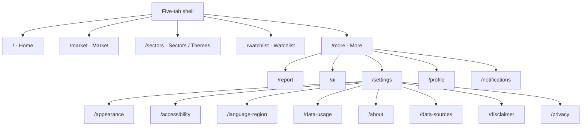

# Stage 9.2A Navigation Registry

The runtime registry is exposed by `frontend/src/architecture/navigationRegistry.ts`. Entity parameters are delegated to the Entity Routing Registry.

## Route hierarchy

## Destination families

| Family | Canonical route | Selector parameters | Consumers |
|---|---|---|---|
| Market section | `/market` | `section`, `commandTarget` | Home; Search; Copilot |
| Sector/Theme section | `/sectors` | `section`, `commandTarget` | Search; Copilot |
| Stock detail | `/watchlist` | `section=stocks`, `symbol`, `detailTab` | Home; Search; Copilot |
| Sector detail | `/sectors` | `entityKind=sector`, `entityId`, `entityName` | Home; Watchlist; Search; Copilot |
| Theme detail | `/sectors` | `entityKind=theme`, `entityId`, `entityName` | Home; Watchlist; Search; Copilot |
| Report | `/report` | `reportId`, optional `sectionId` | More; Home; Search; Copilot |

## Cleanup

- Command search now consumes the architecture navigation facade.
- Copilot action resolution consumes the same facade.
- All entity-specific parameter construction delegates to `buildEntityDestination()`.
- Static routes are enumerated by `STATIC_ROUTE_REGISTRY` and checked against entity routes.
